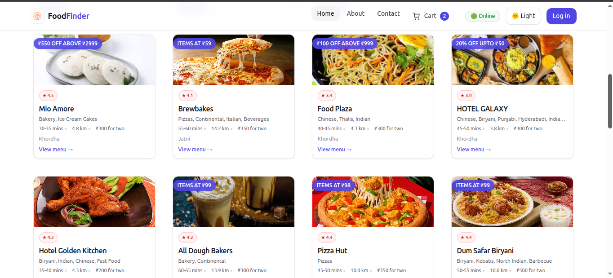
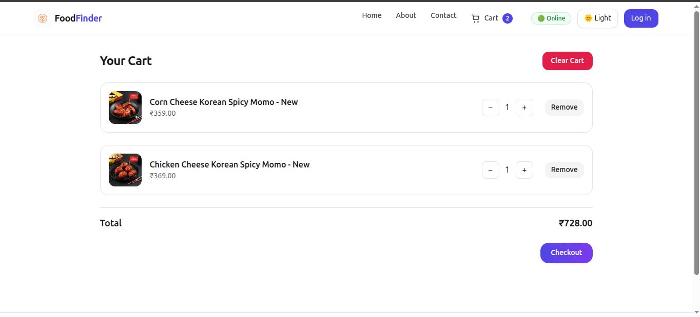
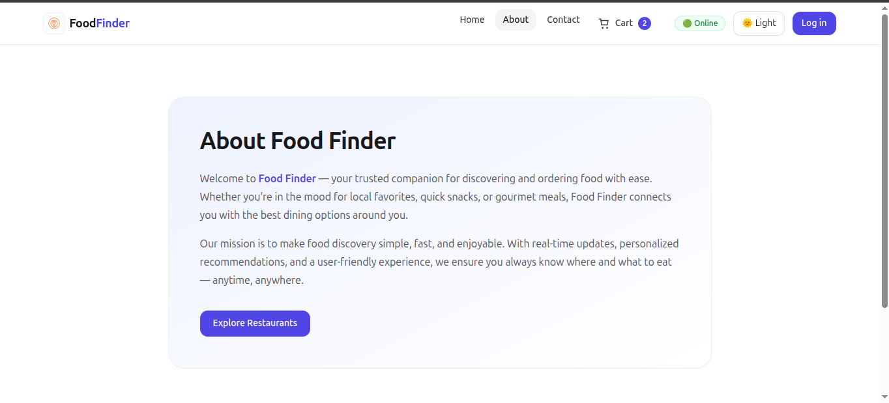
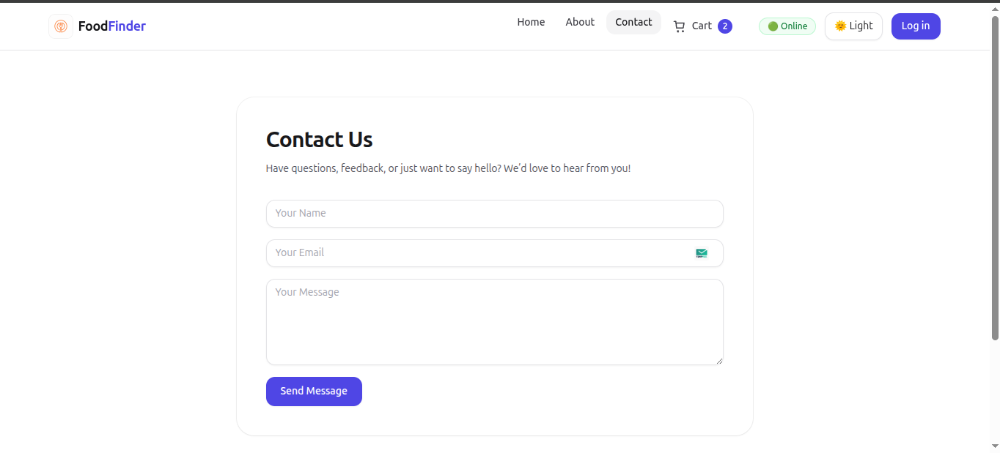

# 🍴 Food Finder  

A modern **food discovery web application** built with **React**, **Tailwind CSS**, **Redux Toolkit**, and **Swiggy’s Live API**.  
This project showcases my ability to build **production-ready frontend applications** from scratch, focusing on:  

- 🔹 **State Management** with Redux Toolkit  
- 🔹 **API Integration** with live data  
- 🔹 **UI/UX Design** using Tailwind CSS  
- 🔹 **Testing & Deployment** with Jest and Vercel  

---

## 🌐 Live Demo  

🚀 [**Food Finder on Vercel**](https://food-finder-omega.vercel.app/)  

⚠️ *Note:* Swiggy’s live API does not allow cross-origin requests (CORS).  
To test locally or on Vercel, please install a [CORS-unblocker browser extension](https://chromewebstore.google.com/detail/allow-cors-access-control/lhobafahddgcelffkeicbaginigeejlf?hl=en).  

---

## 📸 Screenshots  

### Homepage  
  

### Cart  
  

### About  
  

### Contact  
  

---

## ✨ Features  

- ⚡ **From-Scratch Setup** – Configured without boilerplates  
- 🧩 **Reusable Components** – Clean JSX & React best practices  
- 🎨 **Tailwind CSS** – Modern, responsive UI with utility-first styling  
- ⚛️ **React Hooks** – `useState`, `useEffect`, `useReducer`, `useContext`, custom hooks  
- 🗺️ **React Router** – Client-side routing for pages (Home, About, Contact, Cart, Restaurant)  
- 🔌 **Live API Integration** – Real-time restaurant data via Swiggy APIs  
- 🛒 **Redux Toolkit** – Robust state management for authentication, cart, filters  
- 🔐 **Authentication Workflow** – Login/Logout handled with Redux state  
- 🧪 **Testing with Jest** – Unit & integration tests for core components  
- 🚀 **Performance Optimizations** – Lazy loading, code-splitting, memoization  
- ☁️ **Deployed on Vercel** – Production-grade hosting  

---

## 🏗️ Project Structure  

```plaintext
src/
 ┣ tests/              # Jest test cases
 ┣ components/         # Reusable React components
 ┣ mock/               # Mock data for testing
 ┣ src-utils/          # Utility functions & hooks
 ┃ ┗ hooks/            # Custom React hooks
 ┣ app.js              # Root app
 ┣ setupTests.js       # Jest setup
 ┗ index.html / css    # Entry point

```
## ⚙️ Tech Stack  

- **Frontend Framework:** React (Functional Components)  
- **Styling:** Tailwind CSS  
- **State Management:** Redux + Redux Toolkit  
- **Routing:** React Router  
- **Testing:** Jest  
- **Deployment:** Vercel  
- **API:** Swiggy Live API  

---

## 🧪 Testing  

The app includes **unit and integration tests** for components like:  
- `Cart`  
- `Header`  
- `SearchBar`  
- `RestaurantCard`  

---

## 👉Getting Started  

Follow these steps to run the project locally:  

### 1️⃣ Clone the repository and install dependencies  

```bash
git clone https://github.com/your-username/food-finder.git
cd food-finder
npm install
```
### 2️⃣ Run development server
```bash
npm start
```
### 3️⃣ Run tests
```bash
Copy code
npm test
```
### 4️⃣ Build for production
```bash
Copy code
npm run build
```
### 👨‍💻 Developed By

**©Arpon Roy**  

🔗 [LinkedIn](https://www.linkedin.com/in/arpon-roy-b461321a8/)  
🐙 [GitHub](https://github.com/ArponRoy7)  


